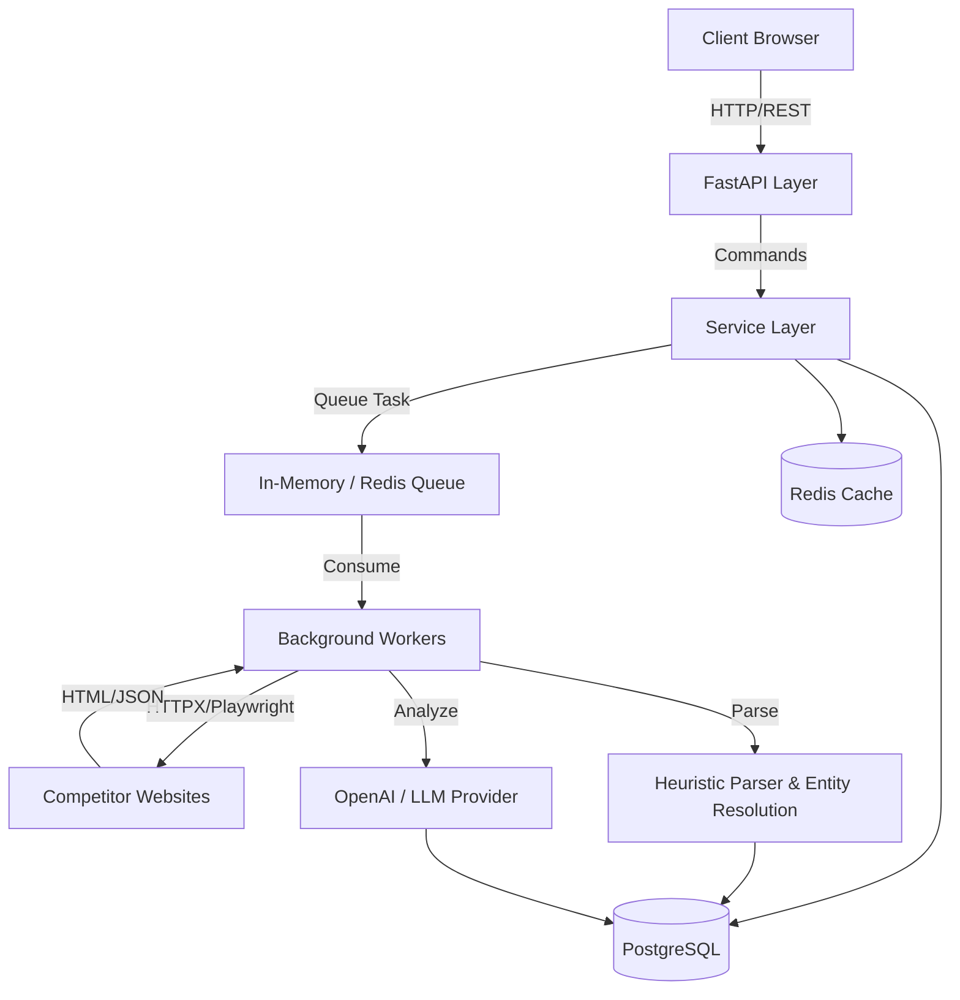

# Competitor Intelligence Engine

## Overview

The Competitor Intelligence Engine is a high-performance, asynchronous data collection and analysis platform. It autonomously monitors competitor web properties, extracts structured data utilizing heuristic parsing and machine learning, and stores the resulting entities in a relational database for intelligence reporting. 

Designed for scalability and reliability, it solves the brittleness of traditional web scraping by avoiding hardcoded CSS selectors in favor of generalized DOM analysis, entity resolution, and AI-driven insight generation. 

Targeted at enterprise data teams, business analysts, and competitive intelligence units, the platform provides a complete end-to-end pipeline from HTML ingestion to a professional React-based reporting dashboard.

---

## Key Features

- **Automated Web Scraping**: Hybrid extraction leveraging static HTTP requests (HTTPX) and headless browser rendering (Playwright).
- **Competitor Monitoring**: Periodic scheduling and incremental crawling utilizing ETag and Last-Modified caching.
- **AI-Powered Insight Generation**: Structured data synthesis via an OpenAI-compatible pipeline with automatic resilience and JSON schema validation.
- **Background Workers**: Dedicated async worker processes for non-blocking scraping and AI tasks.
- **Scheduling**: Built-in async task scheduling for hourly, daily, or weekly competitor refreshes.
- **PostgreSQL**: Robust relational data storage using SQLAlchemy with asyncpg.
- **Docker Support**: Containerized deployment configurations for development, staging, and production.
- **REST APIs**: FastAPI-driven endpoints with OpenAPI documentation and rate-limiting.
- **Dashboard**: Professional React frontend for managing competitors and visualizing extracted intelligence.
- **Observability**: Prometheus metrics, structured JSON logging (structlog), and a dedicated `/debug/metrics` endpoint.
- **Automated Testing**: Comprehensive Pytest suite covering unit, integration, and load testing.

---

## System Architecture



---

## Technology Stack

### Backend
- **Python 3.12+**
- **FastAPI**: High-performance web framework.
- **SQLAlchemy 2.0 (Async)**: ORM and query builder.
- **Pydantic V2**: Data validation and serialization.
- **Playwright**: Headless browser automation.
- **Tenacity**: Exponential backoff and retry mechanisms.

### Frontend
- **React 18**: User interface library.
- **TailwindCSS**: Utility-first styling.
- **Vite**: Frontend build tooling.

### Database
- **PostgreSQL 14+**: Primary relational datastore.
- **Alembic**: Database schema migrations.
- **Asyncpg**: Asynchronous PostgreSQL driver.

### AI
- **OpenAI Python SDK**: For interfacing with OpenAI and NIM-compatible endpoints.

### Infrastructure & DevOps
- **Docker & Docker Compose**: Container orchestration.
- **Uvicorn/Gunicorn**: ASGI server deployment.
- **uv**: Fast Python package management.

### Testing
- **Pytest**: Test execution framework.
- **Locust**: High-concurrency load testing.
- **Ruff**: Linter and formatter.
- **Mypy**: Static type checking.

---

## Repository Structure

```text
.
├── app/
│   ├── ai/                 # AI pipeline and background workers
│   ├── api/                # FastAPI routing and endpoints
│   ├── collectors/         # Scraping and fetcher implementations
│   ├── configuration/      # Pydantic-based settings management
│   ├── database/           # SQLAlchemy models and connection pooling
│   ├── parsers/            # HTML parsing strategies and entity resolution
│   ├── schedulers/         # Async cron task definitions
│   └── main.py             # Application entrypoint
├── docs/                   # Extended architectural documentation
├── frontend/               # React Dashboard source code
├── migrations/             # Alembic migration scripts
├── scripts/                # Utility and monitoring scripts
├── tests/                  # Unit, integration, and load tests
├── docker-compose.yml      # Multi-container orchestration
├── pyproject.toml          # Python dependencies and build config
└── README.md
```

---

## Getting Started

### Prerequisites
- Python 3.12+
- Node.js 18+
- PostgreSQL 14+
- Docker (optional)

### Local Setup

1. **Clone the repository:**
   ```bash
   git clone <repository-url>
   cd competitor-intelligence-engine
   ```

2. **Install dependencies:**
   ```bash
   uv venv .venv
   source .venv/bin/activate
   uv pip install -e ".[dev]"
   playwright install chromium
   ```

3. **Configure environment variables:**
   ```bash
   cp .env.example .env
   # Edit .env with your database credentials and API keys
   ```

4. **Initialize database & run migrations:**
   ```bash
   alembic upgrade head
   ```

5. **Start backend server:**
   ```bash
   uv run uvicorn app.main:app --reload --port 8000
   ```

6. **Start frontend dashboard (in a new terminal):**
   ```bash
   cd frontend
   npm install
   npm run dev
   ```

---

## Environment Variables

The application configures via environment variables prefixed with `CI_`. Nested settings utilize a double underscore `__`.

| Variable | Required | Description | Example |
|---|---|---|---|
| `CI_ENVIRONMENT` | No | Deployment environment | `development`, `production` |
| `CI_DEBUG` | No | Enables debug logging and CORS | `true`, `false` |
| `CI_API_KEY` | Yes (Prod) | Bearer token for API endpoints | `secure-random-string` |
| `CI_DATABASE__URL` | Yes | Asyncpg connection string | `postgresql+asyncpg://usr:pw@localhost/db` |
| `CI_DATABASE__POOL_SIZE` | No | SQLAlchemy max connections | `50` |
| `CI_LLM__API_KEY` | Yes | OpenAI or NIM API key | `sk-...` |
| `CI_LLM__MODEL_NAME` | Yes | LLM model identifier | `gpt-4o`, `meta/llama-3.1-70b-instruct` |
| `CI_LLM__BASE_URL` | No | Custom LLM endpoint override | `https://integrate.api.nvidia.com/v1` |

*(Note: Never commit secrets to version control. Use `.env` locally or secret managers in production.)*

---

## Docker

The project natively supports containerized workflows.

- **`Dockerfile`**: Defines the multi-stage build for the FastAPI backend, optimized for minimal image size.
- **`docker-compose.yml`**: Provisions the full stack, including PostgreSQL, Redis (optional), and the backend server.
- **`docker-compose.test.yml`**: Provisions an ephemeral database dedicated to running the Pytest suite.

**Run via Docker Compose:**
```bash
docker-compose up -d --build
```
This maps PostgreSQL to `5434` and the API to `8000`.

---

## API Overview

The API is fully documented via an automated OpenAPI specification (available at `/docs` when running).

- **`/competitors`**: CRUD operations, searching, pagination, and manual triggering of the intelligence collection pipeline.
- **`/dashboard`**: Pre-aggregated statistics, trends, health checks, and extraction reports tailored for the React frontend.
- **`/collection`**: Internal collection pipeline controls.
- **`/reports`**: Data export endpoints (CSV, PDF).
- **`/health`**: Liveness and readiness probes for load balancers.
- **`/debug/metrics`**: Application-level telemetry (CPU, RAM, DB Pool size, Queue depth).

---

## AI Pipeline

The AI architecture supplements heuristic extraction with semantic insight generation:

1. **Input**: Unstructured HTML and text artifacts fetched by the Collector layer.
2. **Processing**: The background worker invokes `AIPipeline`, which delegates processing to `OpenAIProvider`.
3. **Validation**: Requests are forced into `json_object` mode. Responses are explicitly validated against predefined Pydantic schemas. Corrupted JSON output automatically triggers exponential backoff and regeneration via Tenacity.
4. **Output**: Structured business intelligence (e.g., pricing models, feature sets, target audience) is committed to the database under `competitor_ai_insights`.

---

## Database

The engine relies on a strictly relational schema managed by PostgreSQL.

- **ORM**: SQLAlchemy 2.0 utilizing the asynchronous driver (`asyncpg`).
- **Migrations**: Alembic handles iterative schema versioning.
- **Relationships**: Normalized tables linking Competitors to URLs, Events, Extracted Entities, and AI Insights.
- **JSONB**: Used judiciously for schemaless configurations, raw DOM snapshots, and arbitrary AI output structures.

---

## Testing

The repository contains a robust testing strategy ensuring zero regressions.

**Execute Unit and Integration Tests:**
```bash
uv run pytest tests/ -v
```

**Execute Static Analysis:**
```bash
uv run mypy app
uv run ruff check app
```

**Execute Load Testing (Locust):**
```bash
uv run locust -f locustfile.py --host=http://localhost:8000
```

---

## CI/CD

Continuous Integration is enforced via GitHub Actions (`ci.yml`). Every Pull Request validates:
- Code formatting and linting (Ruff).
- Static type checking (Mypy).
- Complete test suite execution against an ephemeral PostgreSQL service container.
- Build validation of the Dockerfile.

---

## Security

- **Authentication**: Core endpoints are secured via Bearer token validation matching `CI_API_KEY`.
- **Validation**: Strict Pydantic models validate all incoming payloads to prevent injection.
- **Configuration**: Sensitive keys are exclusively injected via environment variables.
- **Resilience**: Rate limiting middleware (`RateLimitMiddleware`) and dynamic exponential backoff safeguard against abuse and external API starvation.

---

## Deployment

The application is stateless (save for the PostgreSQL dependency) and can be deployed to any Docker-compatible infrastructure:

- **VPS / Bare Metal**: Deploy via `docker-compose.yml`.
- **Cloud Providers (AWS/GCP/Azure)**: Deploy the containerized backend via ECS, Cloud Run, or App Service, connecting to managed PostgreSQL (RDS/Cloud SQL).
- **PaaS (Render/Railway)**: Connect the repository directly, specifying `uv run uvicorn app.main:app --host 0.0.0.0 --port $PORT` as the start command.

---

## Performance

The engine is engineered to handle thousands of competitors and high-throughput concurrent access.

- **Asynchronous IO**: Entirely non-blocking architecture allows a single worker to handle hundreds of concurrent web requests and database transactions.
- **Connection Pooling**: SQLAlchemy session pooling manages database locks securely.
- **Scaling**: Background queue consumption allows horizontal scaling by spinning up additional worker containers independent of the API nodes.
- *(Benchmarked to securely handle 100-500 concurrent active users on standard hardware utilizing Gunicorn process multiplexing).*

---

## Screenshots

*(UI Screenshots Placeholder)*
- `dashboard_overview.png`
- `competitor_analysis_view.png`
- `ai_insight_report.png`

---

## Roadmap

- Native integration with Kafka for enterprise message streaming.
- Headless browser proxy rotation support.
- Configurable webhooks for Slack/Teams alerts on competitor feature changes.
- Export to Apache Parquet for data warehouse integration.

---

## Contributing

We welcome contributions from the community. Please ensure that all modifications pass the local test suite, maintain 100% type safety, and adhere to the Ruff linting rules before submitting a Pull Request. See `CONTRIBUTING.md` for extended guidelines.

---

## License

This project is licensed under the MIT License. See [LICENSE](LICENSE) for details.
