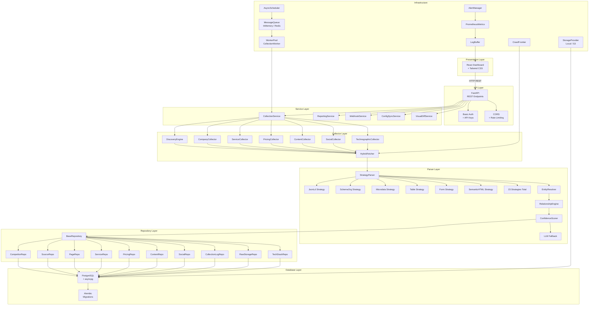

# System Architecture

## Overview

The Utservio Competitor Intelligence Engine is a production-grade, full-stack data collection and analysis platform. It crawls competitor websites using a hybrid fetching engine (httpx + Playwright), extracts structured data through 23 adaptive parsing strategies with zero CSS selectors, resolves entities, links relationships, and stores everything in PostgreSQL. A React-based SaaS dashboard provides real-time monitoring, competitor management, collection control, log exploration, report generation, and system administration.

The system follows a layered architecture with clear separation of concerns: Presentation (React Dashboard) → API (FastAPI) → Service → Collector → Parser → Repository → Database. Cross-cutting concerns including scheduling, message queuing, worker pools, observability, and alerting are woven through the layers.

## High-Level Architecture

## Component Responsibilities

### Presentation Layer

| Component | Technology | Responsibility |
|-----------|-----------|----------------|
| React Dashboard | React 18 + TypeScript | SPA frontend with 8 modules: Overview, Competitors, Competitor Profile, Collections, Logs, Reports, Admin, Login |
| Tailwind CSS | Tailwind 3.4 | Utility-first CSS framework for responsive, consistent UI |
| Vite | Vite 6 | Development server with HMR, build tooling, API proxy to backend |

### API Layer

| Component | Technology | Responsibility |
|-----------|-----------|----------------|
| FastAPI | FastAPI 0.115 | Async HTTP framework, OpenAPI auto-generation, request validation |
| Basic Auth | HTTPBasic | Dashboard authentication via Basic Authentication header |
| API Key Auth | APIKeyHeader | Programmatic API access via `X-API-Key` header |
| CORS Middleware | Starlette | Cross-origin resource sharing configuration |
| Rate Limiter | Custom middleware | 300 requests/minute global rate limiting |
| Security Headers | Custom middleware | X-Content-Type-Options, X-Frame-Options, HSTS |

### Service Layer

| Component | Responsibility |
|-----------|----------------|
| CollectionService | Orchestrates the full collection pipeline: load competitor → discover URLs → fetch pages → parse → store → log → notify |
| ReportingService | Generates collection reports, diff reports, comparison reports, trend reports |
| WebhookService | Sends Slack/Teams notifications on collection events with retry logic |
| ConfigSyncService | Syncs `competitors.json` configuration file to database on startup |
| VisualDiffService | Perceptual hash-based screenshot comparison between collection runs |

### Collector Layer

| Component | Responsibility |
|-----------|----------------|
| CompanyCollector | Extracts company information (name, description, locations, team) |
| ServiceCollector | Extracts service listings with content hash deduplication |
| PricingCollector | Extracts pricing tiers, plans, billing cycles with content hash deduplication |
| ContentCollector | Extracts blog posts, articles, news, resources |
| SocialCollector | Extracts social media profiles (LinkedIn, Twitter, etc.) |
| TechnographicCollector | Detects technology stack via Playwright (React, Vue, WordPress, Stripe, etc.) |
| DiscoveryEngine | Discovers URLs via robots.txt, sitemaps, navigation links, footer links, internal links |
| HybridFetcher | Hybrid HTTP client: httpx for static pages, Playwright for JavaScript-rendered SPAs |
| PageAnalyzer | Detects JS frameworks, dynamic indicators, content quality |

### Parser Layer

| Component | Responsibility |
|-----------|----------------|
| StrategyParser | Orchestrates 23 parsing strategies in priority order with adaptive reordering |
| 23 Strategies | JsonLd, SchemaOrg, Microdata, Table, Form, FAQ, Breadcrumb, SemanticHTML, Card, List, Location, Team, Review, TrustSignal, Asset, Media, GenericDom, GenericCss, Regex, Metadata, MultiPass, and more |
| EntityResolver | Normalizes, deduplicates, and clusters extracted entities using fuzzy matching |
| RelationshipEngine | Links entities via name matching, text overlap, DOM proximity, plan-feature associations |
| ConfidenceScorer | Dynamic per-field confidence based on strategy class, consistency, validation rules |
| LLM Fallback | OpenAI-compatible client with circuit breaker and retry for low-confidence extractions |

### Repository Layer

| Component | Responsibility |
|-----------|----------------|
| BaseRepository | Generic CRUD with get_by_id, get_all, create, update, delete, count, exists |
| 13 Repositories | Competitor, Source, Page, Service, Pricing, Content, Social, CollectionLog, RawStorage, TechStack, Team, Certification, ServiceArea |
| Native Upsert | Database-level upsert operations for idempotent data insertion |

### Database Layer

| Component | Responsibility |
|-----------|----------------|
| PostgreSQL | Primary data store with 13 relational tables |
| asyncpg | Async PostgreSQL driver for non-blocking I/O |
| SQLAlchemy Async | ORM with async session management, relationship loading |
| Alembic | Database migration management with 5 migration versions |

### Infrastructure

| Component | Responsibility |
|-----------|----------------|
| AsyncScheduler | Publishes collection jobs to queue at configurable intervals (hourly/daily/weekly) |
| MessageQueue | Publisher/subscriber pattern with InMemory and Redis backends, DLQ support |
| WorkerPool | Multiple CollectionWorker instances consuming queue messages with retry and recovery |
| AlertManager | Rule-based alerting with cooldown periods for error rates, memory, confidence |
| PrometheusMetrics | Custom counters, gauges, histograms for API, collector, parser, database metrics |
| LogBuffer | Real-time structlog capture for dashboard live log streaming |
| StorageProvider | Local filesystem storage for raw HTML snapshots, with S3 stub for future |
| CrawlFrontier | Priority-based URL scheduling with scoring, decay, and budget enforcement |

## Communication Between Components

### Synchronous Communication

- **Dashboard → FastAPI**: HTTP REST requests with Basic Auth headers
- **FastAPI → Repository**: Direct async method calls within request lifecycle
- **Repository → PostgreSQL**: SQLAlchemy async session with connection pooling
- **FastAPI → Service**: Direct async method calls for on-demand operations

### Asynchronous Communication

- **Scheduler → MessageQueue**: Publishes `COLLECTION` messages with competitor_id payload
- **MessageQueue → WorkerPool**: Workers consume messages via polling loop
- **WorkerPool → CollectionService**: Workers execute collection pipeline asynchronously
- **CollectionService → WebhookService**: Sends notifications after collection completion
- **AlertManager → PrometheusMetrics**: Evaluates alert rules against metric thresholds

## Request Lifecycle

A typical API request flows through these stages:

1. **HTTP Request** arrives at FastAPI with `Authorization: Basic ...` header
2. **Rate Limiter** checks request count against 300/min threshold
3. **Security Headers Middleware** adds X-Content-Type-Options, HSTS, etc.
4. **CORS Middleware** validates origin and adds CORS headers
5. **Authentication** verifies Basic Auth credentials against `ADMIN_USER`/`ADMIN_PASSWORD`
6. **Router** matches URL to endpoint handler
7. **Dependency Injection** provides async database session via `get_session()`
8. **Endpoint Handler** executes business logic, calls repositories
9. **Repository** constructs SQLAlchemy query, executes against async session
10. **Response** serialized as JSON, returned to client

## Collection Lifecycle

A collection job follows this lifecycle:

1. **Trigger**: Scheduler detects due competitor OR API receives trigger request
2. **Queue Publish**: Job published to MessageQueue with `MessageType.COLLECTION`
3. **Worker Consume**: CollectionWorker dequeues message from queue
4. **Load Competitor**: CollectionService loads competitor config from database
5. **Discovery**: DiscoveryEngine discovers URLs via robots.txt, sitemaps, navigation
6. **URL Selection**: URLs filtered by module patterns (company, services, pricing, etc.)
7. **Fetch**: HybridFetcher retrieves pages (httpx for static, Playwright for dynamic)
8. **Parse**: StrategyParser runs 23 strategies, resolves entities, links relationships
9. **Store**: Repositories upsert extracted data into PostgreSQL
10. **Log**: CollectionLog records success/failure, duration, records collected
11. **Notify**: WebhookService sends Slack/Teams notification if configured
12. **Metrics**: Prometheus counters and histograms updated

## Scheduler Lifecycle

1. **Startup**: Scheduler starts during FastAPI lifespan, creates background task
2. **Check Loop**: Every `check_interval_seconds` (default 60s), queries database for due competitors
3. **Frequency Check**: For each enabled competitor, compares last collection time against frequency
4. **Publish**: Due competitors published as collection jobs to MessageQueue
5. **Pause/Resume**: Can be paused/resumed via API endpoints
6. **Shutdown**: Scheduler stops gracefully during FastAPI shutdown

## Worker Lifecycle

1. **Startup**: WorkerPool starts N workers (configurable via `CI_QUEUE__NUM_WORKERS`)
2. **Poll Loop**: Each worker polls MessageQueue every 1 second for new messages
3. **Consume**: Worker dequeues message, marks as PROCESSING
4. **Execute**: Worker calls handler function (collection pipeline)
5. **Acknowledge**: On success, message acknowledged and removed
6. **Retry**: On failure, message requeued with incremented retry_count
7. **Dead Letter**: After max_retries (default 3), message moved to DLQ
8. **Shutdown**: Workers stop gracefully, finishing current job

## Dashboard Lifecycle

1. **Load**: React app initializes, checks `localStorage` for auth credentials
2. **Auth Check**: If no credentials, redirects to `/login`
3. **Login**: User submits credentials, validated against backend `/api/dashboard/stats`
4. **Dashboard**: On success, stores Base64 credentials, redirects to `/`
5. **Overview**: Fetches stats, feed, health, telemetry via polling (10-30s intervals)
6. **Competitors**: Fetches competitor list with search, filter, pagination
7. **Actions**: CRUD operations, collection triggers, bulk operations via API calls
8. **Real-time**: Live data updates via polling hooks with configurable intervals
