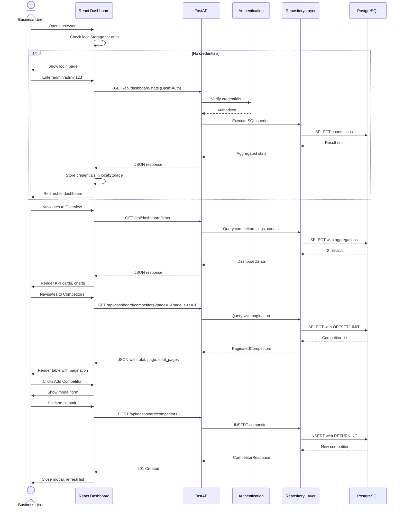
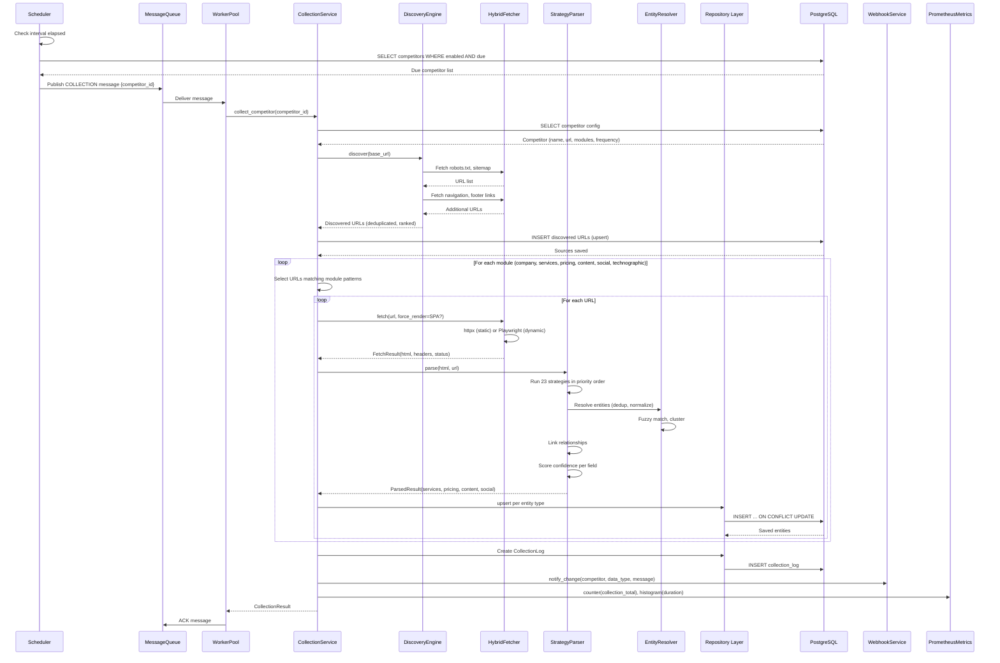
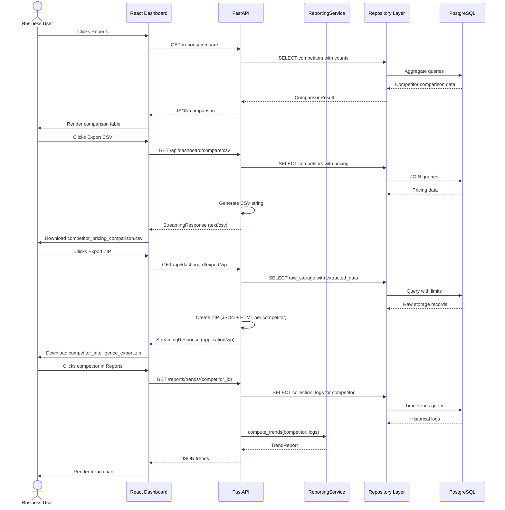
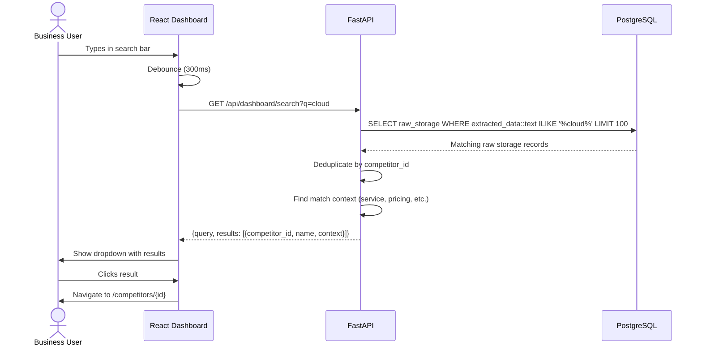
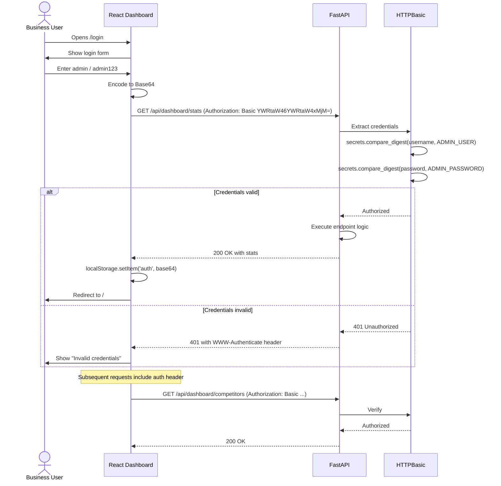

# Complete Data Flow

## Overview

This document traces data through every major pathway in the Utservio Competitor Intelligence Engine, from user interaction to database persistence and back.

## Dashboard Flow

The dashboard flow covers every interaction between the business user and the React frontend.

## Collection Flow

The collection flow traces how data moves from trigger to database persistence.

## Report Generation Flow

## Search Flow

## Authentication Flow

