# Database Overview

## Overview

The Utservio Competitor Intelligence Engine uses PostgreSQL as its primary data store, accessed via SQLAlchemy 2.0 async ORM with the asyncpg driver. The schema contains 13 tables with full relational integrity, cascade deletes, unique constraints, and indexes.

## ER Diagram

```mermaid
erDiagram
    competitors {
        int id PK
        string name UK
        string website_url
        bool enabled
        enum collection_frequency
        json modules
        json tags
        text notes
        timestamp created_at
        timestamp updated_at
    }

    competitor_sources {
        int id PK
        int competitor_id FK
        string url
        string page_type
        timestamp discovered_at
        timestamp last_crawled_at
        bool is_active
    }

    competitor_pages {
        int id PK
        int competitor_id FK
        int source_id FK
        string url
        int status_code
        string title
        text content_hash
        timestamp collected_at
    }

    competitor_services {
        int id PK
        int competitor_id FK
        string name
        text description
        float starting_price
        string currency
        text content_hash
        timestamp collected_at
        json provenance
    }

    competitor_pricing {
        int id PK
        int competitor_id FK
        string service_name
        float base_price
        string currency
        string category
        string billing_cycle
        text content_hash
        timestamp collected_at
        json provenance
    }

    competitor_content {
        int id PK
        int competitor_id FK
        string title
        string url
        string content_type
        text summary
        text content_hash
        timestamp collected_at
    }

    competitor_social {
        int id PK
        int competitor_id FK
        enum platform
        string url
        string username
        int followers
        text content_hash
        timestamp collected_at
    }

    collection_logs {
        int id PK
        int competitor_id FK
        timestamp start_time
        timestamp end_time
        bool success
        float duration_seconds
        int records_collected
        json errors
        int retry_count
    }

    raw_storage {
        int id PK
        int competitor_id FK
        string storage_uri
        json extracted_data
        text content_hash
        timestamp collected_at
    }

    competitor_tech_stack {
        int id PK
        int competitor_id FK
        string technology_name
        string category
        float confidence
        timestamp discovered_at
    }

    competitor_team_members {
        int id PK
        int competitor_id FK
        string name
        string title
        string linkedin_url
        timestamp collected_at
    }

    competitor_certifications {
        int id PK
        int competitor_id FK
        string name
        string issuer
        date issued_date
        date expiry_date
        timestamp collected_at
    }

    competitor_service_areas {
        int id PK
        int competitor_id FK
        string region
        string country
        string city
        timestamp collected_at
    }

    competitors ||--o{ competitor_sources : "has"
    competitors ||--o{ competitor_pages : "has"
    competitors ||--o{ competitor_services : "has"
    competitors ||--o{ competitor_pricing : "has"
    competitors ||--o{ competitor_content : "has"
    competitors ||--o{ competitor_social : "has"
    competitors ||--o{ collection_logs : "has"
    competitors ||--o{ raw_storage : "has"
    competitors ||--o{ competitor_tech_stack : "has"
    competitors ||--o{ competitor_team_members : "has"
    competitors ||--o{ competitor_certifications : "has"
    competitors ||--o{ competitor_service_areas : "has"
    competitor_sources ||--o{ competitor_pages : "discovers"
```



## Table Descriptions

### Core Tables

| Table | Records | Description |
|-------|---------|-------------|
| `competitors` | N | Registered competitor websites with configuration |
| `competitor_sources` | N×M | Discovered URLs per competitor |
| `competitor_pages` | N×M | Crawled pages with status codes |
| `collection_logs` | N×K | Historical collection execution records |

### Extracted Data Tables

| Table | Records | Description |
|-------|---------|-------------|
| `competitor_services` | N×S | Extracted service listings |
| `competitor_pricing` | N×P | Extracted pricing tiers |
| `competitor_content` | N×C | Extracted blog posts, articles |
| `competitor_social` | N×L | Extracted social media profiles |
| `competitor_tech_stack` | N×T | Detected technologies |
| `competitor_team_members` | N×TM | Team member information |
| `competitor_certifications` | N×CERT | Certifications and badges |
| `competitor_service_areas` | N×SA | Geographic service regions |

### Storage Tables

| Table | Records | Description |
|-------|---------|-------------|
| `raw_storage` | N×R | Raw HTML snapshots and extracted JSON |

## Relationships

### Foreign Keys

| Parent | Child | FK Column | On Delete |
|--------|-------|-----------|-----------|
| `competitors` | `competitor_sources` | `competitor_id` | CASCADE |
| `competitors` | `competitor_pages` | `competitor_id` | CASCADE |
| `competitors` | `competitor_services` | `competitor_id` | CASCADE |
| `competitors` | `competitor_pricing` | `competitor_id` | CASCADE |
| `competitors` | `competitor_content` | `competitor_id` | CASCADE |
| `competitors` | `competitor_social` | `competitor_id` | CASCADE |
| `competitors` | `collection_logs` | `competitor_id` | CASCADE |
| `competitors` | `raw_storage` | `competitor_id` | CASCADE |
| `competitors` | `competitor_tech_stack` | `competitor_id` | CASCADE |
| `competitors` | `competitor_team_members` | `competitor_id` | CASCADE |
| `competitors` | `competitor_certifications` | `competitor_id` | CASCADE |
| `competitors` | `competitor_service_areas` | `competitor_id` | CASCADE |
| `competitor_sources` | `competitor_pages` | `source_id` | SET NULL |

### Cascade Deletes

When a competitor is deleted, all related records are automatically deleted:

```
DELETE FROM competitors WHERE id = 1;
-- Automatically deletes:
-- competitor_sources WHERE competitor_id = 1
-- competitor_pages WHERE competitor_id = 1
-- competitor_services WHERE competitor_id = 1
-- competitor_pricing WHERE competitor_id = 1
-- competitor_content WHERE competitor_id = 1
-- competitor_social WHERE competitor_id = 1
-- collection_logs WHERE competitor_id = 1
-- raw_storage WHERE competitor_id = 1
-- competitor_tech_stack WHERE competitor_id = 1
-- competitor_team_members WHERE competitor_id = 1
-- competitor_certifications WHERE competitor_id = 1
-- competitor_service_areas WHERE competitor_id = 1
```

## Unique Constraints

| Table | Columns | Constraint Name |
|-------|---------|----------------|
| `competitors` | `name` | `uq_competitor_name` (implicit via unique) |
| `competitor_sources` | `competitor_id`, `url` | `uq_competitor_source_url` |

## Indexes

| Table | Index | Columns |
|-------|-------|---------|
| `competitor_sources` | `ix_competitor_source_competitor_id` | `competitor_id` |
| `competitor_sources` | `ix_competitor_source_url` | `url` |

## Repository Pattern

All database access goes through repository classes that extend `BaseRepository[T]`:

```python
class BaseRepository[T: Base]:
    def __init__(self, session: AsyncSession, model: type[T]) -> None:
        self._session = session
        self._model = model

    async def get_by_id(self, record_id: int) -> T | None: ...
    async def get_all(self, skip: int = 0, limit: int = 100) -> Sequence[T]: ...
    async def count(self) -> int: ...
    async def create(self, **kwargs) -> T: ...
    async def update(self, record_id: int, **kwargs) -> T | None: ...
    async def delete(self, record_id: int) -> bool: ...
    async def exists(self, record_id: int) -> bool: ...
```

### Specialized Repositories

| Repository | Special Methods |
|-----------|----------------|
| `CompetitorRepository` | `get_by_name()`, `get_enabled()`, `get_by_frequency()`, `enable()`, `disable()` |
| `CollectionLogRepository` | `get_latest_by_competitor()` |
| `CompetitorSourceRepository` | `get_by_url()`, `mark_crawled()` |

## Async Sessions

Database sessions are managed via context managers with automatic commit/rollback:

```python
@asynccontextmanager
async def session(self) -> AsyncGenerator[AsyncSession, None]:
    async with self._session_factory() as session:
        try:
            yield session
            await session.commit()
        except Exception:
            await session.rollback()
            raise
```

Each collection URL gets its own short-lived session to prevent long-running transactions.

## Raw HTML Storage

Raw HTML snapshots are stored both in the database (`raw_storage` table) and on the local filesystem:

- **Database**: `extracted_data` (JSON), `content_hash` (SHA-256), `collected_at`
- **Filesystem**: `storage/raw_html/{content_hash}.html`

The `storage_uri` column in `raw_storage` points to the filesystem path.

## Historical Snapshots

Every collection run creates a new `collection_log` entry and stores raw snapshots in `raw_storage`. This enables:

- **Diff Reports**: Compare data between two collection runs
- **Trend Analysis**: Track changes over time
- **Audit Trail**: Complete history of what was collected and when
- **Reprocessing**: Raw HTML can be re-parsed with updated strategies

## Connection Pooling

SQLAlchemy's connection pool is configured with:

| Setting | Value | Description |
|---------|-------|-------------|
| `pool_size` | 10 | Base connections in pool |
| `max_overflow` | 20 | Additional connections under load |
| `pool_timeout` | 30s | Max wait for connection |
| `pool_recycle` | 1800s | Connection recycling interval |
| `pool_pre_ping` | true | Test connections before use |
