# End-to-End Sequence Diagrams

## Overview

This document provides detailed sequence diagrams for every major workflow in the Utservio Intelligence Platform.

## 1. User Login Flow

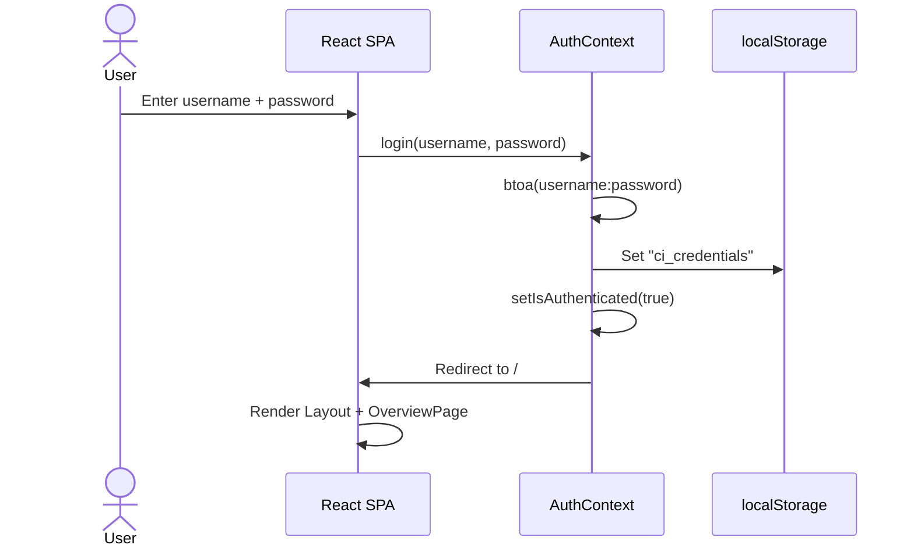

## 2. Dashboard Data Loading

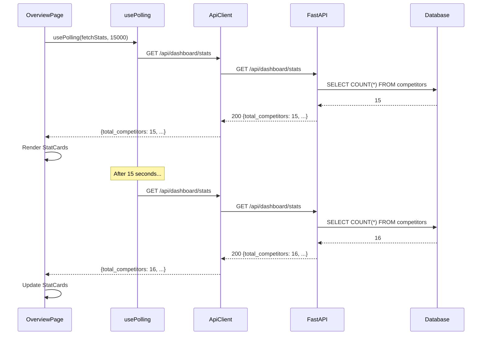

## 3. Competitor Creation

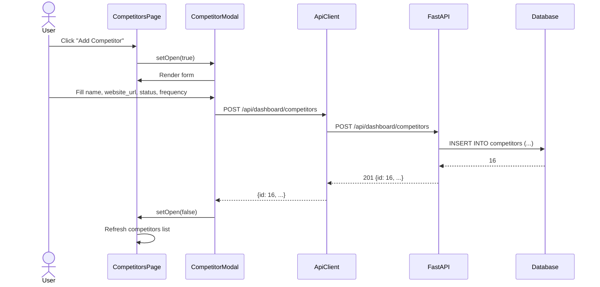

## 4. Competitor Collection Pipeline

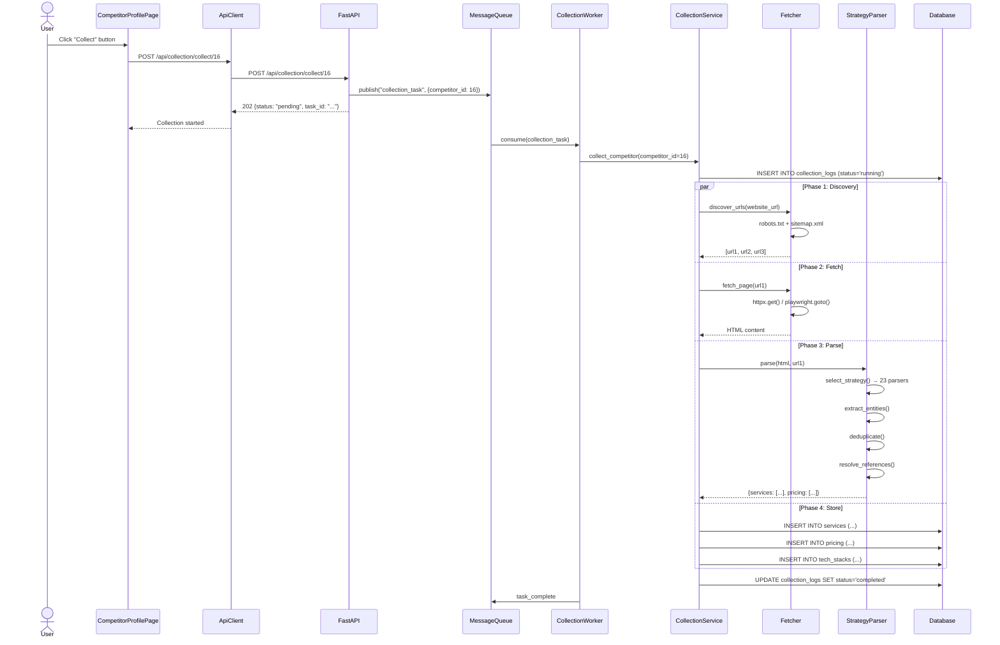

## 5. Bulk Operations

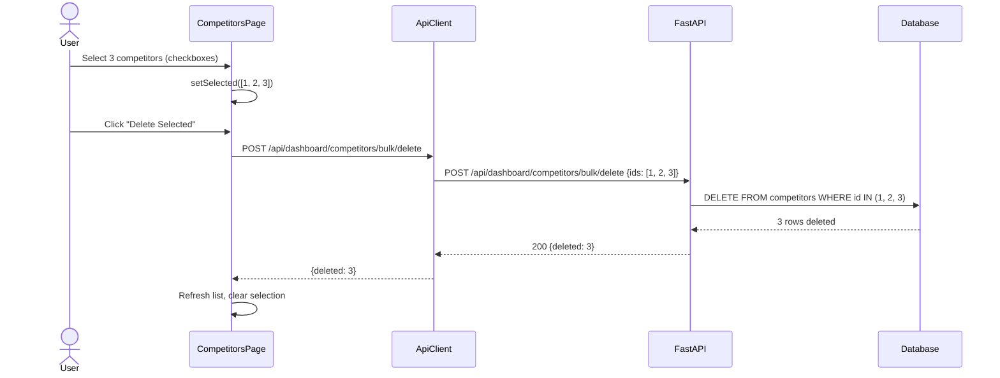

## 6. Scheduler Management

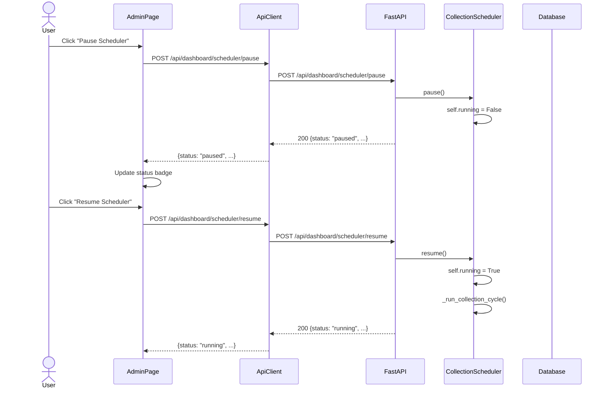

## 7. Log Exploration

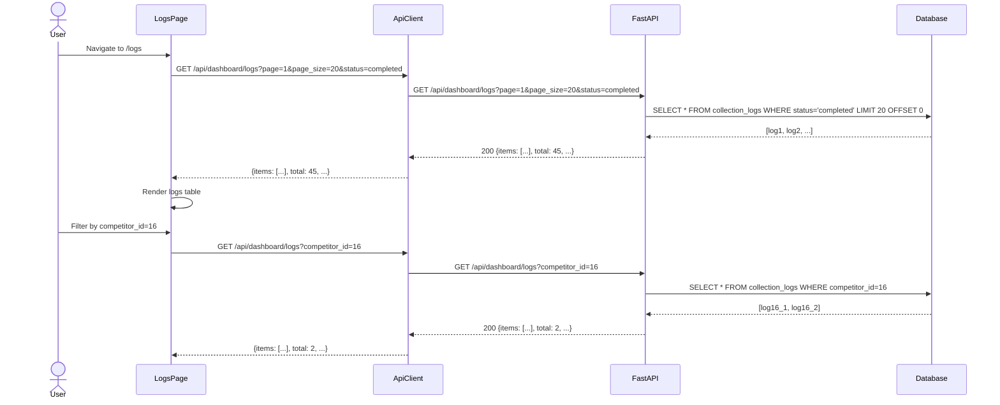

## 8. Report Export

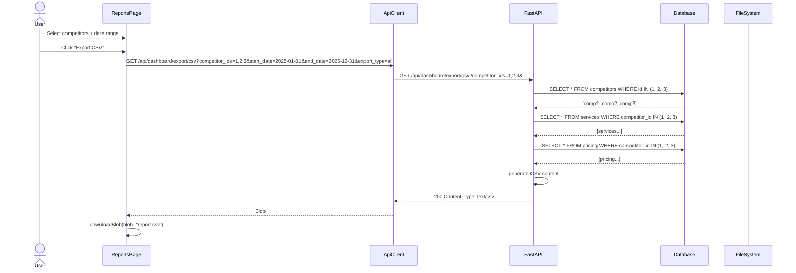

## 9. Global Search

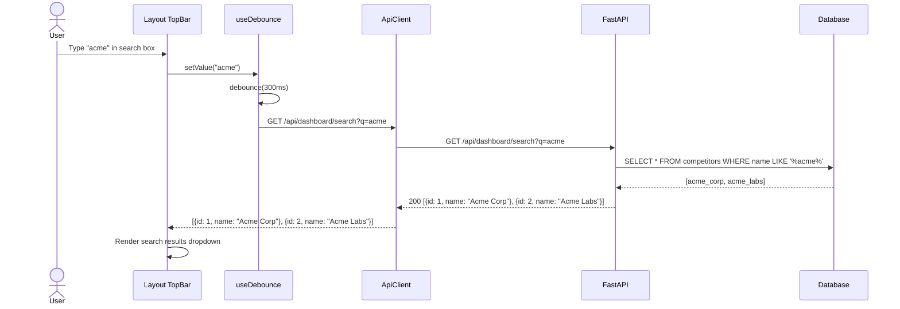

## 10. System Health Monitoring

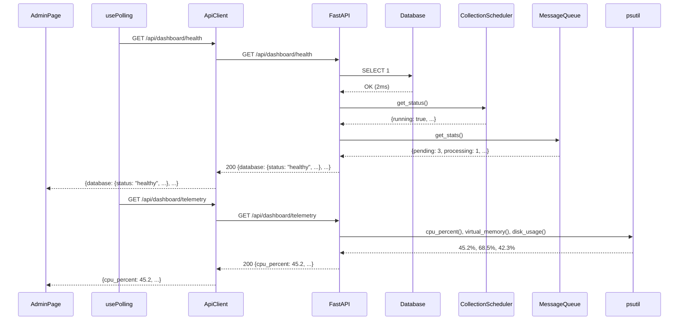

## Component Interaction Diagram

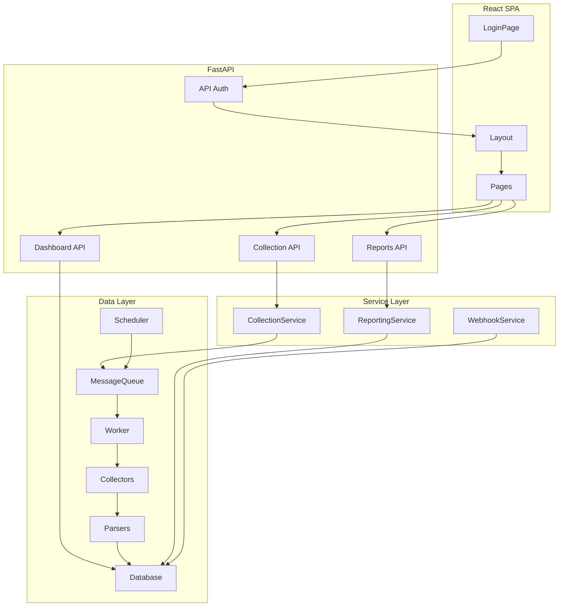
