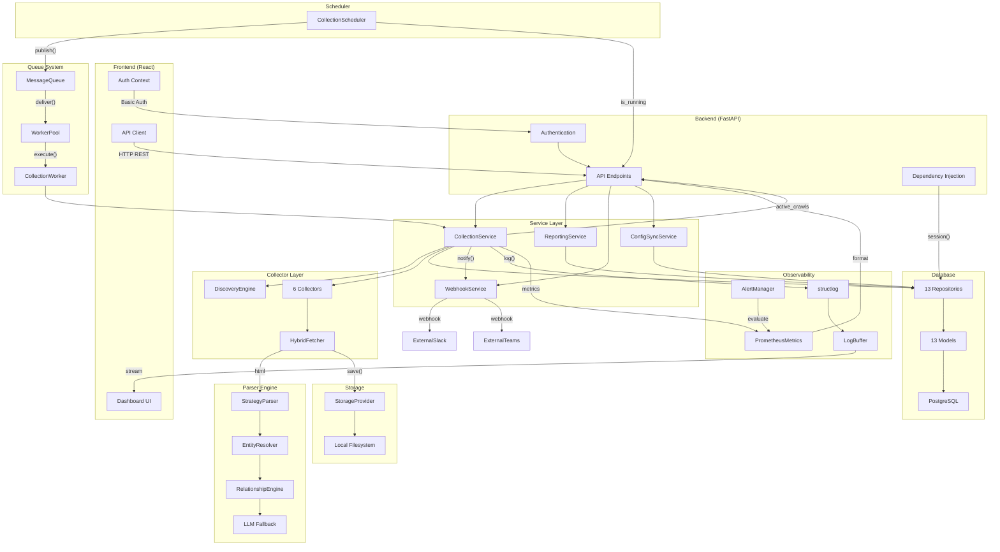

# Module Integration

## Overview

This document explains how every major module in the Utservio Competitor Intelligence Engine integrates with every other module. Prior to the integration sprint, several components existed in isolation. This section documents how they are now connected.

## Integration Map



## Detailed Integration Points

### Frontend ↔ Backend APIs

The React dashboard communicates exclusively with the FastAPI backend through HTTP REST calls. The API client (`frontend/src/lib/api.ts`) encapsulates all API interactions:

| Frontend Module | Backend Endpoint | Integration Method |
|----------------|------------------|-------------------|
| Overview Page | `/api/dashboard/stats`, `/feed`, `/health`, `/telemetry` | Polling every 10-30s |
| Competitors Page | `/api/dashboard/competitors` | Polling + CRUD operations |
| Competitor Profile | `/api/dashboard/competitors/{id}`, `/extracted/{id}` | Polling + action buttons |
| Collections Page | `/api/dashboard/logs`, `/scheduler/status` | Polling every 10s |
| Logs Page | `/api/dashboard/logs` | Polling with filters |
| Reports Page | `/api/dashboard/summary`, `/compare/csv`, `/export/zip` | On-demand fetch |
| Admin Page | `/api/dashboard/health`, `/scheduler/*`, `/telemetry`, `/metrics/json` | Polling every 10-30s |
| Login Page | `/api/dashboard/stats` (with Basic Auth) | On form submit |

Authentication is handled via `localStorage`-persisted Base64 credentials. Every API request includes the `Authorization: Basic ...` header.

### Scheduler → Message Queue → Workers → Collectors

This is the core asynchronous pipeline integration:

```
CollectionScheduler._check_and_publish()
    │
    ├── Queries database for due competitors
    ├── For each due competitor:
    │   └── message_queue.publish(
    │           message_type=MessageType.COLLECTION,
    │           payload={"competitor_id": comp_id},
    │           metadata={"source": "scheduler"}
    │       )
    │
MessageQueue._backend.publish(message)
    │
    ├── InMemoryQueueBackend: appends to internal list
    └── RedisQueueBackend: RPUSH to Redis list
    │
WorkerPool workers[].consume()
    │
    ├── message_queue.process_next()
    ├── Backend.consume() → dequeue message
    ├── Handler registered for MessageType.COLLECTION
    └── collection_handler(message) → collection_service.collect_competitor(id)
```

The scheduler no longer executes collections directly. Instead, it publishes jobs to the message queue, and workers consume them asynchronously. This decouples scheduling from execution and enables horizontal scaling.

### API Trigger → Message Queue → Worker

API-triggered collections follow the same queue path:

```
POST /collection/collect/{id}
    │
    ├── Verify API key
    ├── message_queue.publish(MessageType.COLLECTION, {"competitor_id": id})
    └── Return 202 Accepted

POST /api/dashboard/collect/{id}
    │
    ├── Verify Basic Auth
    ├── message_queue.publish(MessageType.COLLECTION, {"competitor_id": id})
    └── Return 202 Accepted
```

Both the programmatic API and the dashboard API publish to the same queue. Workers consume regardless of source.

### Collector → Parser → Entity Resolution → Repository

Within the collection pipeline, data flows through these stages:

```
Collector.collect(url)
    │
    ├── HybridFetcher.fetch(url) → FetchResult(html, headers)
    ├── StrategyParser.parse(html, url)
    │   ├── For each strategy (JsonLd, SchemaOrg, Table, etc.):
    │   │   ├── strategy.extract(soup) → PartialResult
    │   │   └── If confidence > threshold: merge into ParsedResult
    │   ├── EntityResolver.resolve(parsed_entities)
    │   │   ├── Normalize names, abbreviations
    │   │   ├── Fuzzy match against existing
    │   │   └── Cluster duplicates
    │   ├── RelationshipEngine.link(entities)
    │   │   ├── Name matching
    │   │   ├── Text overlap
    │   │   └── DOM proximity
    │   └── ConfidenceScorer.score(result) → per-field confidence
    │
    ├── For each entity type:
    │   └── Repository.upsert(entity_data)
    │       └── INSERT ... ON CONFLICT ... DO UPDATE
    │
    └── RawStorage.save(html, extracted_data, storage_uri)
```

### Logging → Prometheus → Dashboard

Observability data flows from collection through to the dashboard:

```
structlog.info("collection_completed", elapsed=12.5, records=45)
    │
    ├── LogBuffer.add_log(event) → stores in memory (max 1000)
    ├── PrometheusMetrics.counter("collection_total", 1)
    ├── PrometheusMetrics.histogram("collection_duration", 12.5)
    │
Dashboard Live Logs:
    GET /api/dashboard/live_logs/{id}
    └── LogBuffer.get_logs_for_competitor(id) → real-time events

Dashboard Metrics:
    GET /metrics/json
    └── PrometheusMetrics._metrics → formatted JSON

Dashboard Health:
    GET /api/dashboard/health
    └── Aggregates DB, scheduler, queue, memory status
```

### Reports → Database → Dashboard

Report generation reads from the same database as the collection pipeline:

```
GET /reports/compare
    │
    ├── SELECT competitors WHERE enabled
    ├── For each competitor:
    │   ├── COUNT(services), COUNT(pricing), COUNT(content), COUNT(social)
    │   └── SELECT latest collection_log
    └── ReportingService.compute_comparison()

GET /reports/trends/{id}
    │
    ├── SELECT collection_logs WHERE competitor_id AND success
    └── ReportingService.compute_trends()

GET /api/dashboard/summary
    │
    ├── SELECT with OUTER JOINs on services, pricing, content, social
    └── Return per-competitor counts
```

### Authentication → Protected Routes → Frontend

Authentication is enforced at multiple levels:

```
Dashboard Routes (Basic Auth):
    @router.dependencies = [Depends(verify_credentials)]
    │
    ├── HTTPBasic security scheme
    ├── secrets.compare_digest(username, ADMIN_USER)
    ├── secrets.compare_digest(password, ADMIN_PASSWORD)
    └── 401 Unauthorized if invalid

API Routes (API Key):
    @router dependency = Security(verify_api_key)
    │
    ├── APIKeyHeader(name="X-API-Key")
    ├── hmac.compare_digest(api_key, settings.api_key)
    └── 401/403 if invalid

Frontend:
    localStorage.getItem('auth') → Base64 credentials
    │
    ├── Every API request includes Authorization header
    ├── 401 response → clear localStorage → redirect to /login
    └── AuthContext wraps protected routes
```

### Config Sync → Database → Scheduler

On startup, configuration is synchronized:

```
lifespan() startup:
    │
    ├── config_sync_service.sync_competitors()
    │   ├── Read competitors.json
    │   ├── For each competitor in config:
    │   │   ├── Check if exists in database
    │   │   ├── If not: INSERT competitor
    │   │   └── If exists: UPDATE if changed
    │   └── Config → Database sync complete
    │
    ├── scheduler.start()
    │   ├── Reads competitors from database
    │   ├── Checks last collection time
    │   └── Publishes jobs for due competitors
```

The scheduler reads from the database, not from the config file. Config sync ensures the database stays in sync with the configuration file.
