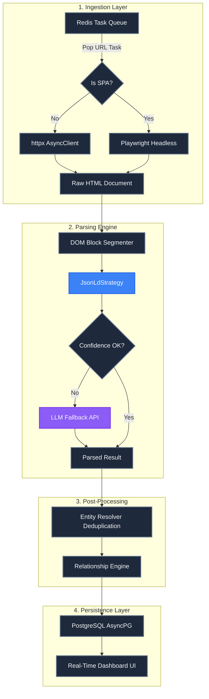

# Competitor Intelligence Pipeline Flow

Here is the updated, simplified pipeline flow after ripping out the redundant DOM parsing strategies.

### Key Changes Reflected:
- **No more Strategy Loop:** Instead of cascading through 22 different CSS/DOM scrapers, the parsing engine immediately checks for `JsonLdStrategy` (Schema.org).
- **Direct to AI:** If the structured data is missing or incomplete (Confidence < 0.8), it routes the raw document straight to the Llama 3 model (`LLMFallbackService`) for intelligent extraction.
- **Deduplication:** Occurs after parsing via `EntityResolver` before hitting the database.
