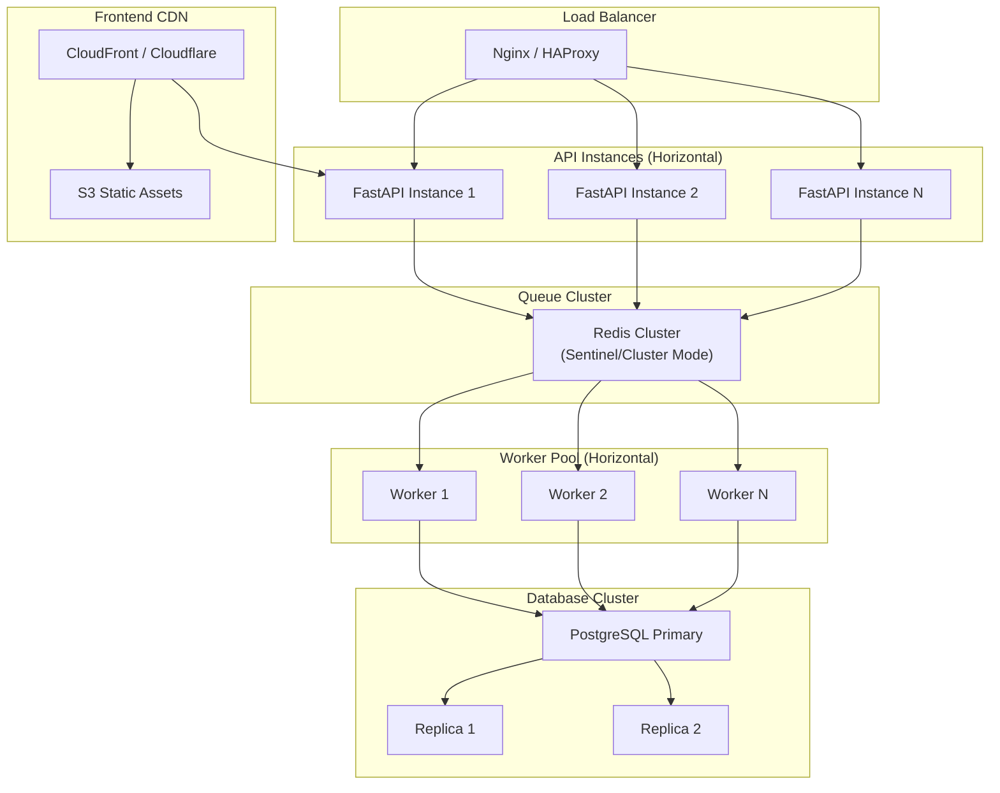

# Scalability & Performance

## Scalability Architecture

The system is designed for horizontal scaling through stateless APIs, queue-based processing, and worker pools.



## Horizontal Scaling

### Stateless API Instances

API instances are stateless - no in-process state shared between requests:

- Database connections via connection pool
- Session-per-request lifecycle
- No in-memory session storage
- Configuration via environment variables

**Scaling**: Add more FastAPI instances behind a load balancer.

### Worker Pool Scaling

Workers consume from a shared queue (Redis):

```python
class WorkerPool:
    def __init__(self, num_workers: int = 1) -> None:
        self.workers = [
            CollectionWorker(worker_id=f"worker-{i + 1}")
            for i in range(num_workers)
        ]
```

**Scaling**: Increase `CI_QUEUE__NUM_WORKERS` or run additional worker processes.

### Database Scaling

PostgreSQL supports read replicas for read-heavy workloads:

- Primary for writes (INSERT, UPDATE, DELETE)
- Replicas for reads (SELECT queries)
- Connection pooling via SQLAlchemy

**Scaling**: Add read replicas, configure SQLAlchemy read/write routing.

## Performance Optimizations

### Async Processing

| Component | Async Technology | Impact |
|-----------|-----------------|--------|
| FastAPI | uvicorn + asyncio | Non-blocking request handling |
| SQLAlchemy | asyncpg driver | Non-blocking database I/O |
| httpx | AsyncClient | Non-blocking HTTP requests |
| Message Queue | InMemoryBackend async | Non-blocking queue operations |
| Worker | asyncio.create_task | Non-blocking background processing |

### Database Optimizations

| Optimization | Implementation | Impact |
|-------------|---------------|--------|
| Connection Pooling | SQLAlchemy pool_size=10, max_overflow=20 | Reuse connections |
| Pre-ping | pool_pre_ping=True | Detect stale connections |
| Batch Operations | Repository upsert | Reduce round trips |
| Indexes | competitor_id indexes on all tables | Fast lookups |
| Pagination | OFFSET/LIMIT with COUNT | Efficient large queries |
| Lazy Loading | selectinload for relationships | N+1 prevention |

### Network Optimizations

| Optimization | Implementation | Impact |
|-------------|---------------|--------|
| Incremental Crawling | ETag/Last-Modified headers | Skip unchanged pages |
| Content Hashing | SHA-256 content dedup | Skip re-parsing |
| Crawl Budget | Per-competitor page/byte limits | Resource protection |
| Rate Limiting | Per-domain throttling | Avoid overloading targets |
| Conditional GET | If-None-Match, If-Modified-Since | Reduce bandwidth |

### Pipeline Optimizations

| Optimization | Implementation | Impact |
|-------------|---------------|--------|
| Strategy Ordering | Adaptive reordering by success rate | Faster extraction |
| Early Termination | Confidence threshold skip | Reduce unnecessary work |
| Parallel Fetching | Concurrent URL processing | Higher throughput |
| Session-per-URL | Short-lived database sessions | Prevent lock contention |
| Deduplication | Global deduplicators reset per run | Memory management |

### Frontend Optimizations

| Optimization | Implementation | Impact |
|-------------|---------------|--------|
| Debounced Search | 300ms debounce on search input | Reduce API calls |
| Polling Intervals | Configurable per-page intervals | Balanced freshness |
| Pagination | Server-side pagination | Reduced data transfer |
| Skeleton Loading | CSS animation placeholders | Perceived performance |
| Lazy Rendering | React component tree | Faster initial load |

## Performance Benchmarks

### Target Metrics

| Metric | Target | Measurement |
|--------|--------|-------------|
| API Response Time | < 100ms (p95) | Prometheus histogram |
| Collection Duration | < 300s per competitor | CollectionLog.duration_seconds |
| Parse Time | < 5s per page | Parser metrics |
| Queue Latency | < 1s message delivery | Queue stats |
| Dashboard Load | < 2s initial render | Browser DevTools |
| Database Query | < 50ms (p95) | SQLAlchemy timing |

### Resource Usage

| Resource | Development | Production |
|----------|-------------|------------|
| API Memory | ~256 MB | ~512 MB |
| Worker Memory | ~256 MB | ~512 MB |
| Database Connections | 10 | 50+ |
| Redis Memory | ~10 MB | ~100 MB |
| Disk (raw HTML) | ~1 GB/1000 competitors | ~10 GB |

## Performance Monitoring

### Prometheus Metrics

```
# Collection metrics
collections_total counter
collection_duration_seconds histogram
collection_errors_total counter

# Parser metrics
parse_duration_seconds histogram
extraction_confidence histogram
strategy_success_rate gauge

# Database metrics
database_query_duration_seconds histogram
database_connections_active gauge
database_errors_total counter

# Queue metrics
queue_published_total counter
queue_consumed_total counter
queue_size gauge
queue_processing_time_seconds histogram
```

### Health Checks

```
GET /health
{
    "status": "healthy",
    "checks": {
        "database": {"status": "healthy", "latency_ms": 5.23},
        "scheduler": {"status": "healthy", "running": true},
        "queue": {"status": "healthy", "queue_size": 0},
        "collection": {"status": "healthy", "active_crawls": 0},
        "memory": {"status": "healthy", "rss_mb": 256.0}
    }
}
```
