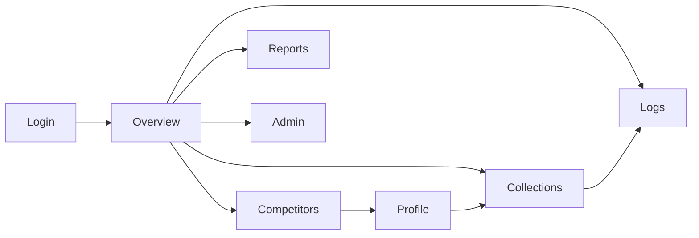

# UI Guide

## Overview

The Utservio Dashboard is a single-page application (SPA) built with React 18, TypeScript, and Tailwind CSS. It communicates with the FastAPI backend via HTTP REST APIs and provides real-time monitoring, competitor management, collection control, log exploration, report generation, and system administration.

## UI Architecture

```mermaid
graph TB
    subgraph Entry["Entry Point"]
        Main["main.tsx"]
        App["App.tsx"]
    end

    subgraph Auth["Authentication"]
        AuthCtx["AuthContext"]
        LoginPage["LoginPage"]
        ProtectedRoute["ProtectedRoute"]
    end

    subgraph Layout["Layout"]
        LayoutComp["Layout"]
        Sidebar["Sidebar Navigation"]
        TopBar["Top Bar + Search"]
    end

    subgraph Pages["Pages"]
        Overview["OverviewPage"]
        Competitors["CompetitorsPage"]
        Profile["CompetitorProfilePage"]
        Collections["CollectionsPage"]
        Logs["LogsPage"]
        Reports["ReportsPage"]
        Admin["AdminPage"]
    end

    subgraph Hooks["Hooks"]
        UsePolling["usePolling"]
        UseDebounce["useDebounce"]
    end

    subgraph Lib["Library"]
        API["api.ts"]
        Utils["utils.ts"]
    end

    subgraph Types["Types"]
        Types["index.ts"]
    end

    Main --> App
    App --> AuthCtx
    App --> LoginPage
    App --> ProtectedRoute
    ProtectedRoute --> LayoutComp
    LayoutComp --> Sidebar
    LayoutComp --> TopBar
    LayoutComp --> Overview
    LayoutComp --> Competitors
    LayoutComp --> Profile
    LayoutComp --> Collections
    LayoutComp --> Logs
    LayoutComp --> Reports
    LayoutComp --> Admin
    Overview --> UsePolling
    Competitors --> UsePolling
    Competitors --> UseDebounce
    Profile --> UsePolling
    Collections --> UsePolling
    Logs --> UsePolling
    Reports --> UsePolling
    Admin --> UsePolling
    UsePolling --> API
    API --> Types
    Utils --> Types
```

## Folder Structure

```
frontend/
├── index.html                    # HTML entry point
├── package.json                  # Dependencies and scripts
├── tsconfig.json                 # TypeScript configuration
├── vite.config.ts                # Vite build configuration
├── tailwind.config.js            # Tailwind CSS configuration
├── postcss.config.js             # PostCSS configuration
└── src/
    ├── main.tsx                  # React entry point
    ├── App.tsx                   # Root component with routing
    ├── index.css                 # Global styles + Tailwind layers
    ├── vite-env.d.ts             # Vite type declarations
    │
    ├── components/
    │   └── Layout.tsx            # Main layout with sidebar + topbar
    │
    ├── pages/
    │   ├── LoginPage.tsx         # Authentication page
    │   ├── OverviewPage.tsx      # Dashboard homepage with KPIs
    │   ├── CompetitorsPage.tsx   # CRUD + bulk operations
    │   ├── CompetitorProfilePage.tsx  # Detailed competitor view
    │   ├── CollectionsPage.tsx   # Collection monitoring
    │   ├── LogsPage.tsx          # Log explorer
    │   ├── ReportsPage.tsx       # Reports + export
    │   └── AdminPage.tsx         # System administration
    │
    ├── hooks/
    │   └── index.ts              # usePolling, useDebounce
    │
    ├── lib/
    │   ├── api.ts                # API client (all endpoints)
    │   └── utils.ts              # Date formatting, helpers
    │
    └── types/
        └── index.ts              # TypeScript interfaces
```

## Component Hierarchy

```
App
├── AuthContext.Provider
│   ├── BrowserRouter
│   │   ├── /login → LoginPage
│   │   └── /* → ProtectedRoute
│   │       └── Layout
│   │           ├── Sidebar (NavLink × 6)
│   │           ├── TopBar (Search + User Menu)
│   │           └── <Outlet> → Page Component
│   │               ├── OverviewPage
│   │               │   ├── StatCard × 8
│   │               │   ├── Activity Feed
│   │               │   └── System Status
│   │               ├── CompetitorsPage
│   │               │   ├── Filter Bar
│   │               │   ├── Bulk Actions
│   │               │   ├── Data Table
│   │               │   ├── Pagination
│   │               │   └── CompetitorModal
│   │               ├── CompetitorProfilePage
│   │               │   ├── Header (name, status, collect button)
│   │               │   ├── Stat Cards × 6
│   │               │   ├── Services Section
│   │               │   ├── Pricing Table
│   │               │   ├── Tech Stack Tags
│   │               │   ├── Content List
│   │               │   ├── Social Profiles
│   │               │   └── Collection History
│   │               ├── CollectionsPage
│   │               │   ├── Status Cards × 4
│   │               │   ├── Scheduler Control
│   │               │   └── Collection Timeline
│   │               ├── LogsPage
│   │               │   ├── Filter Bar
│   │               │   ├── Logs Table
│   │               │   └── Pagination
│   │               ├── ReportsPage
│   │               │   ├── Summary Cards × 3
│   │               │   ├── Comparison Table
│   │               │   └── Export Buttons
│   │               └── AdminPage
│   │                   ├── System Health
│   │                   ├── Scheduler Management
│   │                   ├── Resource Usage
│   │                   ├── Configuration
│   │                   └── Prometheus Metrics
```

## Routing

| Path | Component | Auth Required | Description |
|------|-----------|--------------|-------------|
| `/login` | LoginPage | No | Authentication page |
| `/` | OverviewPage | Yes | Dashboard homepage |
| `/competitors` | CompetitorsPage | Yes | Competitor management |
| `/competitors/:id` | CompetitorProfilePage | Yes | Competitor detail view |
| `/collections` | CollectionsPage | Yes | Collection monitoring |
| `/logs` | LogsPage | Yes | Log explorer |
| `/reports` | ReportsPage | Yes | Reports + export |
| `/admin` | AdminPage | Yes | System administration |

## State Management

The application uses React's built-in state management:

| Pattern | Usage | Implementation |
|---------|-------|----------------|
| Component State | Form inputs, modals, UI state | `useState` |
| Context | Authentication credentials | `AuthContext` + `useContext` |
| Server State | API data, polling | `usePolling` hook |
| Derived State | Filtered/sorted data | Computed in render |
| URL State | Route parameters | `useParams`, `useNavigate` |

### AuthContext

```typescript
interface AuthContextType {
  isAuthenticated: boolean
  login: (username: string, password: string) => void
  logout: () => void
}
```

Credentials stored in `localStorage` as Base64-encoded Basic Auth header.

## API Layer

The API client (`lib/api.ts`) encapsulates all backend communication:

```typescript
class ApiClient {
  private credentials: string | null = null

  setCredentials(username: string, password: string) { ... }
  clearCredentials() { ... }
  isAuthenticated(): boolean { ... }

  private async request<T>(path: string, options?: RequestInit): Promise<T> {
    // Adds Authorization header
    // Handles 401 → clear credentials
    // Returns parsed JSON
  }

  // Dashboard
  async getStats() { ... }
  async getFeed(limit?) { ... }
  async getHealth() { ... }

  // Competitors
  async getCompetitors(params?) { ... }
  async getCompetitor(id) { ... }
  async createCompetitor(data) { ... }
  async updateCompetitor(id, data) { ... }
  async deleteCompetitor(id) { ... }
  async duplicateCompetitor(id) { ... }
  async bulkDelete(ids) { ... }
  async bulkEnable(ids) { ... }
  async bulkDisable(ids) { ... }
  async bulkUpdateFrequency(ids, freq) { ... }

  // Collection
  async triggerCollection(id) { ... }
  async cancelCollection(id) { ... }
  async retryCollection(id) { ... }

  // Logs
  async getLogs(params?) { ... }

  // Scheduler
  async getSchedulerStatus() { ... }
  async pauseScheduler() { ... }
  async resumeScheduler() { ... }

  // Search
  async search(q) { ... }

  // Telemetry
  async getTelemetry() { ... }
}
```

## Reusable Components

| Component | Location | Purpose |
|-----------|----------|---------|
| `StatCard` | Pages (inline) | KPI display with icon, value, label |
| `StatusDot` | Pages (inline) | Color-coded status indicator |
| `Badge` | CSS classes | Status badges (success, danger, warning, info) |
| `CompetitorModal` | CompetitorsPage | Add/Edit competitor form |
| `Layout` | components/Layout.tsx | Sidebar + topbar + content area |

## Theme

### Colors

```javascript
// tailwind.config.js
colors: {
  brand: {
    50: '#f0f4ff',
    100: '#dbe4ff',
    200: '#bac8ff',
    300: '#91a7ff',
    400: '#748ffc',
    500: '#5c7cfa',
    600: '#4c6ef5',
    700: '#4263eb',
    800: '#3b5bdb',
    900: '#364fc7',
  }
}
```

### Design System

| Element | Style |
|---------|-------|
| Cards | `bg-white rounded-xl border border-gray-200 shadow-sm` |
| Primary Button | `bg-brand-600 text-white rounded-lg hover:bg-brand-700` |
| Secondary Button | `bg-white text-gray-700 border border-gray-300 rounded-lg` |
| Danger Button | `bg-red-600 text-white rounded-lg hover:bg-red-700` |
| Input | `border border-gray-300 rounded-lg focus:ring-2 focus:ring-brand-500` |
| Table Header | `bg-gray-50 text-xs font-semibold text-gray-500 uppercase` |
| Badge Success | `bg-green-100 text-green-800 rounded-full` |
| Badge Danger | `bg-red-100 text-red-800 rounded-full` |
| Sidebar Link | `flex items-center gap-3 px-3 py-2.5 rounded-lg hover:bg-gray-100` |
| Sidebar Active | `bg-brand-50 text-brand-700 rounded-lg` |

## Responsive Behavior

| Breakpoint | Layout |
|-----------|--------|
| < 768px | Sidebar collapsed, single column |
| 768px - 1024px | Sidebar visible, 2-column grid |
| > 1024px | Full sidebar, 4-column grid |

Tables horizontal scroll on mobile. Cards stack vertically.

## Page Flow



## Polling Intervals

| Page | Interval | Endpoint |
|------|----------|----------|
| Overview | 15s | `/api/dashboard/stats` |
| Overview | 20s | `/api/dashboard/feed` |
| Overview | 30s | `/api/dashboard/health` |
| Overview | 10s | `/api/dashboard/telemetry` |
| Competitors | 15s | `/api/dashboard/competitors` |
| Profile | 30s | `/api/dashboard/competitors/{id}` |
| Collections | 10s | `/api/dashboard/logs` |
| Collections | 10s | `/api/dashboard/scheduler/status` |
| Logs | 15s | `/api/dashboard/logs` |
| Reports | 30s | `/api/dashboard/summary` |
| Admin | 20s | `/api/dashboard/health` |
| Admin | 15s | `/api/dashboard/scheduler/status` |
| Admin | 10s | `/api/dashboard/telemetry` |
| Admin | 30s | `/metrics/json` |

## Future UI Improvements

| Enhancement | Priority | Description |
|------------|----------|-------------|
| Dark Mode | Medium | Toggle between light/dark themes |
| WebSocket Updates | High | Real-time data without polling |
| Keyboard Shortcuts | Low | Power user navigation |
| Dashboard Customization | Low | Drag-and-drop widget layout |
| Data Visualization | Medium | Charts for trends and comparisons |
| Export Scheduling | Low | Automated report generation |
| Notification Center | Medium | In-app notification panel |
| Mobile App | Low | React Native companion app |
